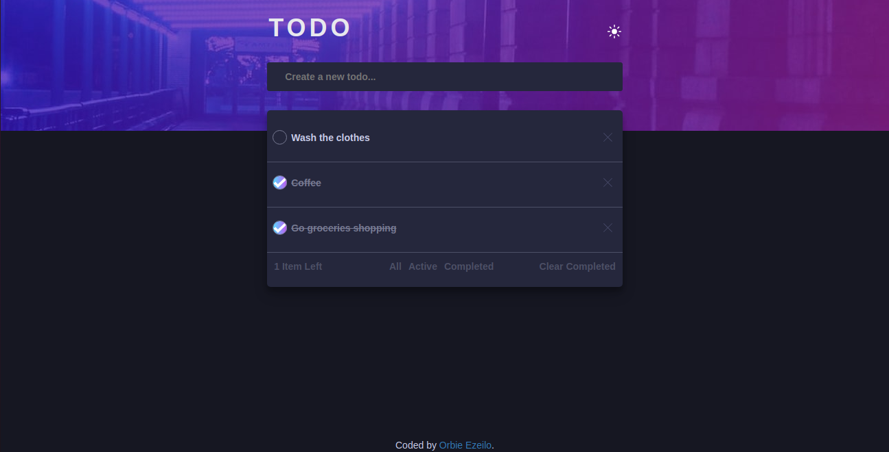

# Todo app solution

## Table of contents

- [Overview](#overview)
  - [The challenge](#the-challenge)
  - [Screenshot](#screenshot)
  - [Links](#links)
  - [Built with](#built-with)
  - [What I learned](#what-i-learned)
  - [Continued development](#continued-development)
  - [Useful resources](#useful-resources)
- [Author](#author)
- [Acknowledgments](#acknowledgments)

## Overview

### The challenge

Users should be able to:

- View the optimal layout for the app depending on their device's screen size
- See hover states for all interactive elements on the page
- Add new todos to the list
- Mark todos as complete
- Delete todos from the list
- Filter by all/active/complete todos
- Clear all completed todos
- Toggle light and dark mode
- **Bonus**: Drag and drop to reorder items on the list

### Screenshot



### Links

- Solution URL: [Github repository](https://github.com/Moween/active-tod)
- Live Site URL: [Preview Project](https://moween.github.io/active-todo/)


### Built with

- Semantic HTML5 markup
- CSS custom properties
- Flexbox
- Mobile-first workflow
- Vanilla Javascript
- [Google Fonts](https://fonts.googleapis.com/css?family=Josefin+Sans) - For font.
- [Bootstrap CDN](https://maxcdn.bootstrapcdn.com/bootstrap/3.3.7/css/bootstrap.min.css) - For styles

### What I learned

I learn't a lot while working on this project. But these are the major highlights of this project.

- Creating a custom checkbox.
- Positioning a container absolute on the fly while populating a list. 
- Toggling page theme from light theme to dark theme.

```css
/* Custom Checkbox */
label::before {
  content: '';
  height: 1.39em;
  left: -11px;
  outline: none;
  position: absolute;
  width: 1.39em;  
  transform: scale(0) rotateZ(180deg); 
  transition: all 0.3s;
}

input[type="checkbox"]:checked + label::before {
  background: url("./images/icon-check.svg") no-repeat, 
  linear-gradient(to right, hsl(192, 100%, 67%), hsl(280, 87%, 65%));
  background-position: center;
  background-size: contain;
  border-radius: 50%;
  transform: scale(1) rotateZ(0deg);
}

label::after {
  border: 1px solid var(--darkGrayishBlue);
  border-radius: 50%;
  height: 1.5em;
  content: "";
  top: -1px;
  left: -12px;
  margin-right: 5px;
  position: absolute;
  width: 1.5em;
  -webkit-transform: scale(1) rotate(0);
        transform: scale(1) rotate(0);
}
```
I'm proud of these logic
```js
class TodoLinks {
  constructor() {
    this.li = document.createElement('li');
    const divElem = document.createElement('div');
    divElem.className = 'inner-todocard-div';
    const p = document.createElement('p');
    p.className = 'item';
    divElem.append(p);
    const paragrph2 = document.createElement('p');
    paragrph2.innerHTML = `
    <a  
      href="#" 
      id='clear-completed'
    >
      clear completed
    </a>`;
    paragrph2.onclick = this.handleClearCompleted;
    divElem.append(paragrph2);
    
    // Div Container
    let divContainerHeight = 
      window.getComputedStyle(divContainer).getPropertyValue("height");
    divContainerHeight = divContainerHeight.replace(/\px/, '');
    divContainerHeight = parseInt(divContainerHeight);
    console.log(divContainerHeight);

    // Nav
    const nav = document.createElement('div');
    nav.className = 'nav';

    // Set nav absolute from the top
    nav.style.top = divContainerHeight + 60 + 'px';
    nav.innerHTML = `
      <a href="#" id="all">all</a>
      <a href="#" id="active">active</a>
      <a href="#" id="completed">completed</a>`;

    // Displaying nav for media query
    var displayNav = window.matchMedia("(min-width: 1024px)");
    if(displayNav.matches) {
      divElem.insertBefore(nav, paragrph2);
    }else {
      divElem.append(nav);
    }
    nav.onclick = this.handleAnchorClick;
    nav.onclick = this.filterTodos;    
    this.li.append(divElem);
    this.handleClearCompleted = this.handleClearCompleted.bind(this)
    this.filterTodos = this.filterTodos.bind(this);
  }

  handleClearCompleted = (e) => {
    e.preventDefault();
    let todos = localStorage.getItem('todosList');
    todos = JSON.parse(todos);
  
    todos = todos.filter(todo => todo.completed === false);
    todosListCopy = [...todos];
  
    // Reset localStorage
    localStorage.setItem('todosList', JSON.stringify(todos));  
    displayTodo(todosListCopy);
  }

  filterTodos = (e) => {
    e.preventDefault();
    const msg = document.createElement('p');
    switch(e.target.id) {
      case 'all':
        displayTodo(todosListCopy);
        break;
        case 'active':
          const activeTodos = todosListCopy.filter(todos => todos.completed === false);
          if(!activeTodos.length) {
            ulElem.innerHTML = '';
            msg.textContent = 'No active task.'
            msg.style.textAlign = 'center';
          ulElem.append(msg);
          document.querySelector('#clear-completed').style.display = 'none';
        }
        displayTodo(activeTodos);
        break;
      case 'completed':
        const completedTodos = todosListCopy.filter(todo =>  todo.completed === true);
        if(!completedTodos.length) {
          ulElem.innerHTML = '';
          msg.textContent = '';
          msg.textContent = 'No completed task.'
          msg.style.textAlign = 'center';
          ulElem.append(msg);
          document.querySelector('#clear-completed').style.display = 'none';
        }
        displayTodo(completedTodos);
        break;
      default:
    }
  }
}
```

### Continued development

Learning never ends for a programmer. Though the project has been completed but learning is a continuous process. I intend reading up on event delegation and creating custom styling for some elements in my next project.

### Useful resources

- [W3Schools JS MediaQueries](https://www.w3schools.com) - This helped me for a lot when I restructured the navlinks in desktop view. I really liked this pattern and will use it going forward.
- [Checkbox custom styling](https://www.youtube.com/watch?v=tOggA9H9t-k) - This is an amazing video which helped me finally create a custom style for checkbox. I'd recommend it to anyone still learning to style a custom checkbox.


## Author

- Twitter - [@iamMoween](https://www.twitter.com/iamMoween)

## Acknowledgments

- Kenneth Aladi
- FemCodeAfrica

